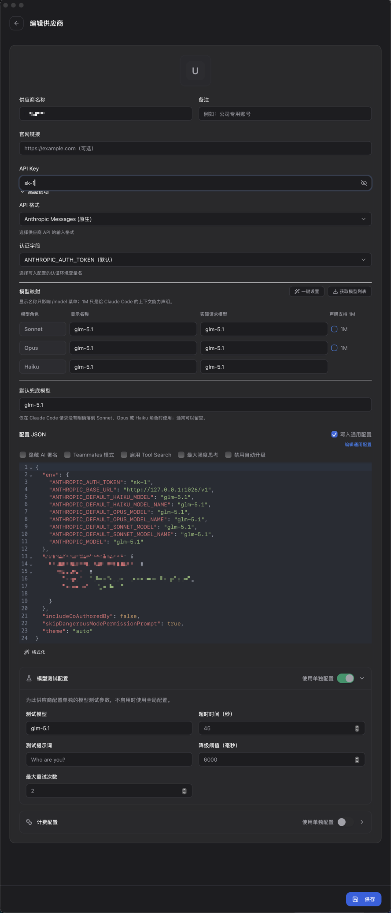

# CodeBuddy CN -> OpenAI API Proxy

将腾讯云 CodeBuddy CN 的聊天 API 代理为标准 OpenAI / Anthropic 兼容格式，使 ChatGPT-Next-Web、LobeChat、Cherry Studio、Cursor、Claude Desktop 等客户端可直接对接。

Go 实现，编译为单个可执行文件，无需安装任何运行时。

## 快速上手（Claude Code / Codex / Open Code）

1. 从 [GitHub Releases](../../releases) 下载对应平台的可执行文件
2. 启动代理，浏览器扫码登录：

```bash
./codebuddy-proxy
```

3. 在 Claude Code 中切换模型提供商（`cc switch`），配置代理地址：



```
API Base URL: http://localhost:1026/v1
```

配置完成后即可在 Claude Code、Codex、Open Code 等工具中使用 CodeBuddy 提供的模型。

## 功能

- **OpenAI Chat Completions** — `/v1/chat/completions`，流式 + 非流式，支持 tool_calls
- **Anthropic Messages** — `/v1/messages`，流式 + 非流式，支持 tool_use / tool_result
- **OpenAI Responses** — `/v1/responses`，流式 + 非流式，支持 function_call
- **动态模型列表** — `/v1/models`，从上游 `/v2/config` 获取并缓存
- **OAuth2 Device Flow** — 浏览器扫码登录，Token 存储于内存，过期自动重登录
- **API Key 认证** — 可选，支持 `Authorization: Bearer` 和 `x-api-key`
- **跨平台** — 单个二进制文件，支持 macOS / Windows / Linux

## 快速开始

### 编译

```bash
make build
```

### 配置

编辑 `.env`：

```
PORT=1026
API_PASSWORD=
```

### 登录

首次使用需通过 OAuth2 获取 Token：

```bash
# 1. 发起认证
curl http://localhost:1026/auth/start
# 返回 auth_url，在浏览器中打开并登录

# 2. 轮询 Token（使用返回的 auth_state）
curl "http://localhost:1026/auth/poll?auth_state=xxx"
# 登录成功后 Token 存储于内存，进程重启需重新登录
```

也可以手动设置 Token：

```bash
curl -X POST http://localhost:1026/auth/manual \
  -H "Content-Type: application/json" \
  -d '{"bearer_token": "your-token-here"}'
```

Token 过期后会自动触发重新登录，打开浏览器等待用户授权。

### 使用

```bash
# OpenAI 格式
curl http://localhost:1026/v1/chat/completions \
  -H "Content-Type: application/json" \
  -d '{"model":"deepseek-v3","messages":[{"role":"user","content":"hello"}]}'

# Anthropic 格式
curl http://localhost:1026/v1/messages \
  -H "Content-Type: application/json" \
  -d '{"model":"deepseek-v3","max_tokens":100,"messages":[{"role":"user","content":"hello"}]}'

# Responses 格式
curl http://localhost:1026/v1/responses \
  -H "Content-Type: application/json" \
  -d '{"model":"deepseek-v3","input":[{"role":"user","content":"hello"}]}'
```

## API 端点

| 端点 | 方法 | 格式 | 说明 |
|------|------|------|------|
| `/v1/chat/completions` | POST | OpenAI Chat | 聊天补全（流式 + 非流式） |
| `/v1/messages` | POST | Anthropic Messages | Anthropic 格式聊天（流式 + 非流式） |
| `/v1/responses` | POST | OpenAI Responses | Responses API 格式（流式 + 非流式） |
| `/v1/models` | GET | OpenAI Models | 动态模型列表 |
| `/auth/start` | GET | — | OAuth2 发起认证 |
| `/auth/poll` | GET | — | OAuth2 轮询 Token |
| `/auth/manual` | POST | — | 手动设置 Token |
| `/auth/status` | GET | — | 查看 Token 状态 |
| `/health` | GET | — | 健康检查 |

## 环境变量

| 变量 | 默认值 | 说明 |
|------|--------|------|
| `PORT` | `1026` | 服务监听端口 |
| `API_PASSWORD` | 空 | 非空时所有 `/v1/*` 端点需认证 |

## 交叉编译

```bash
make build-all
```

或手动指定平台：

```bash
# macOS ARM
GOOS=darwin GOARCH=arm64 go build -o codebuddy-proxy-mac ./cmd/proxy

# macOS Intel
GOOS=darwin GOARCH=amd64 go build -o codebuddy-proxy-mac-intel ./cmd/proxy

# Windows
GOOS=windows GOARCH=amd64 go build -o codebuddy-proxy.exe ./cmd/proxy

# Linux
GOOS=linux GOARCH=amd64 go build -o codebuddy-proxy-linux ./cmd/proxy
```

## 项目结构

```
├── cmd/proxy/main.go               # 入口
├── internal/
│   ├── config/config.go            # 配置
│   ├── auth/
│   │   ├── token.go                # Token 内存缓存 + JWT 解析 + 过期自动重登录
│   │   └── handler.go              # OAuth2 路由 + 上游请求头
│   └── proxy/
│       ├── handler.go              # 路由注册 + 请求处理
│       ├── stream.go               # OpenAI Chat SSE 流式转发 + HTTP Client
│       ├── models.go               # 动态模型列表
│       ├── anthropic.go            # Anthropic 格式转换
│       ├── anthropic_stream.go     # Anthropic 流式转换状态机
│       ├── responses.go            # Responses API 格式转换
│       └── responses_stream.go     # Responses 流式转换
├── Makefile
├── go.mod
└── .env
```

## 技术栈

Go + Gin + godotenv + 标准库 `net/http` / `bufio.Scanner` / `encoding/json`
